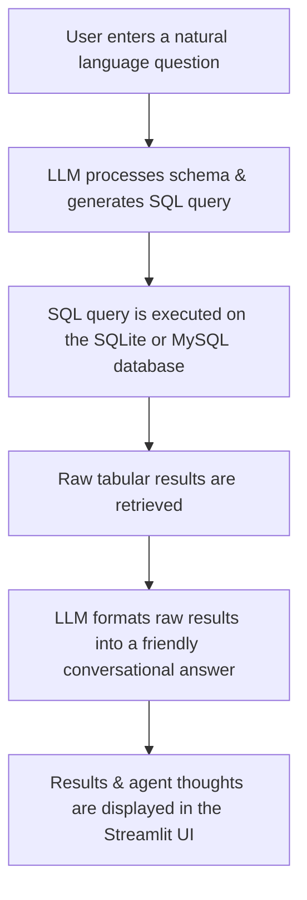

# 🦜 GenAI Project - Chat With SQL

[](https://www.python.org/)
[](https://streamlit.io/)
[](https://github.com/langchain-ai/langchain)
[](https://groq.com/)
[](LICENSE)

An end-to-end Text-to-SQL application that enables users to interact with SQL databases using natural language. The application converts user questions into SQL queries using a Large Language Model (LLM), executes them on the database, and returns the results in a user-friendly conversational format. 

This project serves as an educational reference, containing both a legacy implementation (`app.py`) and a modernized implementation (`appNewVersion.py`) to demonstrate how to use the latest stable LangChain ecosystem.

---

## 📖 Table of Contents
1. [What is Text-to-SQL?](#-what-is-text-to-sql)
2. [How LLMs Convert Natural Language to SQL](#-how-llms-convert-natural-language-to-sql)
3. [Key Features](#-key-features)
4. [Technologies Used](#-technologies-used)
5. [Repository Structure](#-repository-structure)
6. [File Explanations](#-file-explanations)
7. [Older vs. Newer Implementation](#-older-vs-newer-implementation)
8. [Application Workflow](#-application-workflow)
9. [Installation & Setup](#-installation--setup)
10. [Configuration](#-configuration)
11. [Running the Application](#-running-the-application)
12. [Example Usage](#-example-usage)
13. [Future Improvements](#-future-improvements)
14. [Contributing](#-contributing)
15. [License](#-license)

---

## 🔍 What is Text-to-SQL?
**Text-to-SQL** is a technology that bridges the gap between humans and databases. It allows non-technical users to query relational databases using plain natural language (e.g., English) instead of writing complex SQL queries manually. By abstracting the SQL syntax, Text-to-SQL democratizes data access, enabling anyone to retrieve insights instantly from structured databases.

---

## 🧠 How LLMs Convert Natural Language to SQL
Large Language Models (LLMs) convert natural language into SQL by utilizing context and few-shot reasoning:
1. **Schema Contextualization**: The system extracts the database schema (table names, column names, data types, and relationships) and injects it into the prompt.
2. **Instruction Prompting**: The LLM is provided with system instructions that describe how to formulate syntactically correct SQL queries corresponding to the schema.
3. **Reasoning & Synthesis**: The LLM parses the user's question, maps the intent to the schema, synthesizes a valid SQL query, and isolates it for execution.
4. **Execution & Reframing**: The SQL agent executes the query against the database, captures the raw tabular results, and passes them back to the LLM to format into a human-readable response.

---

## ✨ Key Features
* **Dual Database Support**: Easily switch between a local SQLite database (`student.db`) and a remote MySQL database directly from the sidebar.
* **Conversational Interface**: Chat-style history and layout using Streamlit's modern chat widgets.
* **Live Agent Thought Process**: Visualizes the internal reasoning steps, generated SQL queries, and tool execution using `StreamlitCallbackHandler`.
* **Safe Read-Only Operations**: Configures SQLite database connections in read-only (`mode=ro`) mode to prevent malicious modifications.
* **Comparative Implementations**: Provides a side-by-side legacy vs. modern LangChain setup for educational and migration purposes.

---

## 🛠️ Technologies Used
* **Python**: Core language runtime.
* **Streamlit**: Web-based user interface and chat rendering.
* **LangChain / LangChain Community**: Orchestration framework for LLMs, agent tools, and database interaction.
* **LangChain Groq**: LLM provider integration for lightning-fast model execution.
* **SQLAlchemy**: Engine creation and communication interface for SQLite and MySQL.
* **mysql-connector-python**: Connection driver for MySQL integration.
* **SQLite**: Lightweight local relational database storage.

---

## 📂 Repository Structure
```
GenAIProject-ChatWithSQL/
├── .env                  # Configuration file for API keys (e.g., GROQ_API_KEY)
├── .gitignore            # Git configuration file to exclude temporary files/virtualenvs
├── LICENSE               # MIT License file for the repository
├── README.md             # Project documentation
├── app.py                # Legacy Text-to-SQL implementation using older LangChain APIs
├── appNewVersion.py      # Modernized Text-to-SQL implementation using latest LangChain APIs
├── requirements.txt      # List of project dependencies
├── sqlite.py             # Script to initialize and populate the student.db database
├── student.db            # Sample SQLite database containing student information
└── theory.txt            # Document containing theoretical notes on SQLite
```

---

## 📄 File Explanations

| File | Purpose |
| :--- | :--- |
| `app.py` | The older application file showcasing Text-to-SQL using legacy LangChain imports, `AgentType` enums, and `.run()` executor calls. |
| `appNewVersion.py` | The updated version implementing modern import structures (`langchain_community`), passing string agent types directly, and executing with the newer `.invoke()` API. |
| `sqlite.py` | Python script to create the local `STUDENT` table, seed it with dummy records, and compile them into `student.db`. |
| `student.db` | Sample local SQLite database generated by `sqlite.py` containing student details. Users can replace or swap this database with their own schemas. |
| `requirements.txt` | Cleaned package requirements file containing only the strictly necessary modules needed to build and run the application. |
| `theory.txt` | Educational text file containing summary notes on the basics of SQLite and relational databases. |

---

## 🔄 Older vs. Newer Implementation

To help you learn how LangChain APIs have evolved, here is a comparison of key components between `app.py` and `appNewVersion.py`:

| Feature | Older Version (`app.py`) | Modernized Version (`appNewVersion.py`) |
| :--- | :--- | :--- |
| **Imports** | Imported directly from core packages: `langchain.agents`, `langchain.sql_database`, etc. | Imported from the updated integrations: `langchain_community.agent_toolkits`, `langchain_community.utilities`, etc. |
| **Agent Type** | Uses legacy `AgentType.ZERO_SHOT_REACT_DESCRIPTION` enum. | Passes the agent type as a string `"zero-shot-react-description"` directly. |
| **Execution Method** | Uses the deprecated `.run()` method. | Uses the modern `.invoke()` method, returning a dictionary from which output is retrieved using `["output"]`. |
| **LLM Model** | Utilizes Groq's `Llama3-8b-8192` model. | Utilizes Groq's `llama-3.3-70b-versatile` model. |

---

## ⚙️ Application Workflow



1. **User Prompt**: The user asks a question via the chat input (e.g., *"How many students are in Data Science?"*).
2. **SQL Generation**: The LangChain SQL Agent combines the database schema information with the LLM to generate a corresponding SQL query.
3. **Database Querying**: The generated SQL query is executed securely against the database.
4. **Data Retrieval**: Tabular rows matching the query are returned back to the SQL agent executor.
5. **Conversational Response**: The LLM parses the raw rows and constructs a natural language sentence answering the user's prompt.
6. **Interface Rendering**: The response, along with step-by-step reasoning logs, is rendered on the Streamlit dashboard.

---

## 🚀 Installation & Setup

### Prerequisites
* Python 3.8 or higher installed on your system.
* A Groq API key (get one from the [Groq Console](https://console.groq.com/)).

### Step-by-Step Installation

1. **Clone the Repository**
   ```bash
   git clone https://github.com/NamanBagoria/GenAIProject-ChatWithSQL.git
   cd GenAIProject-ChatWithSQL
   ```

2. **Create a Virtual Environment**
   * On Windows:
     ```bash
     python -m venv venv
     venv\Scripts\activate
     ```
   * On macOS/Linux:
     ```bash
     python3 -m venv venv
     source venv/bin/activate
     ```

3. **Install Dependencies**
   ```bash
   pip install -r requirements.txt
   ```

4. **Initialize the SQLite Database**
   Run the initialization script to generate the local `student.db` populated with initial records:
   ```bash
   python sqlite.py
   ```

---

## 🔑 Configuration

1. Create a `.env` file in the root of the project:
   ```env
   GROQ_API_KEY=your_actual_groq_api_key_here
   ```
2. Alternatively, you can copy-paste your API key directly into the sidebar text input field when running the Streamlit app.

---

## 🏃 Running the Application

### Version 1: Running the Legacy Implementation
To run the older version of the app using legacy LangChain APIs:
```bash
streamlit run app.py
```

### Version 2: Running the Modernized Implementation (Recommended)
To run the updated version utilizing modern LangChain community libraries and the latest Groq model:
```bash
streamlit run appNewVersion.py
```

---

## 📊 Example Usage

Once the application is running, you can select **Use SQLite3 Database - Student.db** from the sidebar, enter your API key, and try asking the following questions:

* *"Show me all the students in the database."*
* *"Who has the highest marks in Data Science?"*
* *"What is the average marks of students in DEVOPS?"*
* *"List the students in Section A."*

---

## 🔮 Future Improvements
* **Advanced Security**: Restrict prompt injection attempts by incorporating SQL parser checks before executing statements.
* **LangGraph Integration**: Fully migrate the classic AgentExecutor structure to a multi-node LangGraph setup for more robust error handling and query validation.
* **Chat Memory**: Add session-based database memory using Checkpointers to let users ask follow-up questions referencing previous answers.
* **Semantic Schema Mapping**: Add an embedding-based retriever to fetch table metadata dynamically for larger databases with hundreds of tables.

---

## 🤝 Contributing
Contributions are welcome! If you have suggestions or fixes:
1. Fork this repository.
2. Create your feature branch (`git checkout -b feature/NewFeature`).
3. Commit your changes (`git commit -m 'Add some NewFeature'`).
4. Push to the branch (`git push origin feature/NewFeature`).
5. Open a Pull Request.

---

## 📄 License
This project is licensed under the MIT License - see the [LICENSE](LICENSE) file for details.
